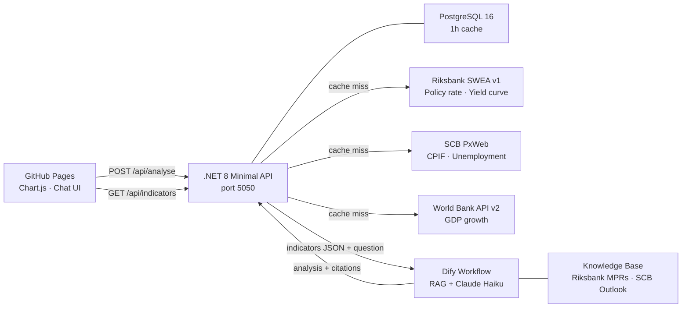

# EconAdvisor

AI-powered macroeconomic analysis assistant for the Swedish economy.
A **.NET 8 Minimal API** fetches live indicators from Riksbank, SCB, and World Bank,
stores them in PostgreSQL, and calls a **Dify RAG workflow** that grounds answers
in Riksbank monetary policy documents.

**Live demo → [okalangkenneth.github.io/EconAdvisor](https://okalangkenneth.github.io/EconAdvisor)**

---

## Architecture



---

## Indicators tracked

| Indicator | Source | What it signals |
|-----------|--------|----------------|
| Policy rate (reporänta) | Riksbank SWEA v1 | Monetary policy stance |
| CPIF inflation | SCB PxWeb | Riksbank's 2% target measure |
| Unemployment rate (15–74) | SCB PxWeb | Labour market health |
| GDP growth (annual %) | World Bank API v2 | Output trend |
| Real interest rate | Derived: rate − CPIF | True cost of borrowing |
| Yield curve slope | Derived: 10y − 2y bond | Recession leading indicator |

---

## Tech stack

| Layer | Technology |
|-------|-----------|
| Backend | .NET 8 Minimal API |
| ORM | EF Core 8 + Npgsql |
| Database | PostgreSQL 16 (Docker) |
| Validation | FluentValidation |
| AI/RAG | Dify 1.13.2 · Claude Haiku |
| Embeddings | Ollama · nomic-embed-text |
| Logging | Serilog → Console + Elasticsearch |
| Observability | ELK — Elasticsearch 7.17 + Kibana 7.17 |
| Demo UI | GitHub Pages · Chart.js · Vanilla JS |
| Containers | Docker Compose |

---

## Local setup

### Prerequisites
- .NET 8 SDK
- Docker Desktop
- Dify running at `http://localhost` (see [dify-etsy-toolkit](https://github.com/okalangkenneth/dify-etsy-toolkit))
- Ollama with `nomic-embed-text` pulled

### 1 — Start infrastructure
```bash
docker compose up -d
```

### 2 — Configure environment
```bash
cp .env.example .env
# Fill in DIFY_WORKFLOW_KEY from your Dify workflow API Access page
```

### 3 — Run the API
```bash
cd EconAdvisor.Api
dotnet run
# API at http://localhost:5050
# Swagger at http://localhost:5050/swagger
```

### 4 — Test the demo UI locally
```bash
cd docs
python -m http.server 8000
# Open http://localhost:8000
```

---

## API endpoints

| Method | Path | Description |
|--------|------|-------------|
| `GET` | `/health` | NpgSql health check |
| `GET` | `/api/indicators/{country}/{series}` | Cached indicator observations |
| `POST` | `/api/analyse` | AI macroeconomic analysis |

**POST /api/analyse example:**
```json
{
  "question": "Is Sweden heading into recession?",
  "country": "SE"
}
```

**Response:**
```json
{
  "question": "Is Sweden heading into recession?",
  "country": "SE",
  "indicators": {
    "policy_rate": 2.5,
    "cpif": 2.1,
    "unemployment": 8.4,
    "gdp_growth": 0.6,
    "real_interest_rate": 0.4,
    "yield_curve_slope": -0.2
  },
  "analysis": "Sweden is showing early warning signs...",
  "citations": ["Riksbank Monetary Policy Report March 2026"],
  "generatedAt": "2026-04-02T10:00:00Z"
}
```

---

## What I'd add for production

- **HTTPS + CORS policy** — currently allows all origins; production would lock to the Pages domain
- **Redis distributed cache** — replace the 1h PostgreSQL TTL with Redis for horizontal scaling
- **Rate limiting** — Riksbank and SCB are public APIs with unwritten rate limits; a token bucket would prevent abuse
- **Authentication** — the `/api/analyse` endpoint calls a paid LLM; without auth any public user can run up costs
- **Structured citation extraction** — the current code falls back to a generic citation when Dify's KB doesn't return named sources; a smarter parser would surface actual document titles and page numbers
- **More Riksbank PDFs** — only 2 documents are indexed; adding all quarterly MPRs would improve RAG recall significantly

---

## Lessons learned

Integrating three public sector APIs in a single pipeline surfaced several non-obvious patterns:

**SCB PxWeb variable codes ≠ display names** — The API expects `"Kon"` not `"Kön"`,
`"Arbetskraftstillh"` not `"Arbetskraftstillhörighet"`. Always fetch the table metadata
endpoint and use the `"code"` field, never the `"text"` field.

**SCB returns JSON-stat, not JSON** — A specialised statistical format with a flat value
array and stride-based dimension indexing. Required a custom parser.

**World Bank wraps data in an outer array** — `[{metadata}, [{data}]]`, not a plain object.

**Dify on Docker + Windows NTFS** — The plugin daemon's `uv` package manager uses reflinks
(copy-on-write) that fail on NTFS-mounted volumes. Fixed by mounting `cwd` as a Docker
named volume and setting `UV_LINK_MODE=copy`.

---

*Kenneth Okalang · [LinkedIn](https://linkedin.com/in/kenneth-okalang) · Uppsala, Sweden*
